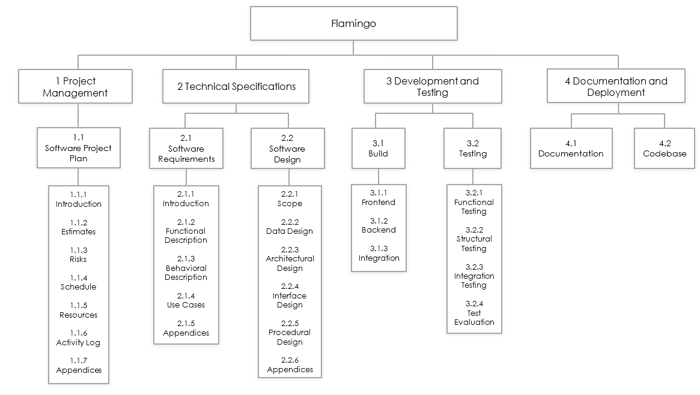
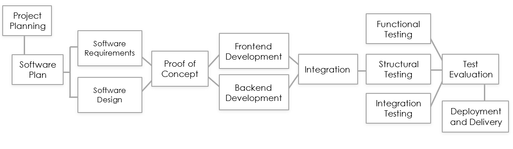
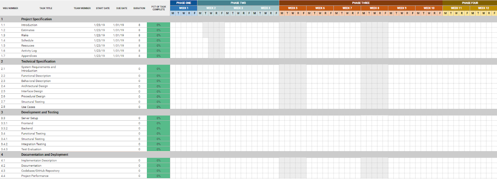

# Flamingo

Jordan Ramsey, Jack Erwin, Blake Ottinger, Grant Hitson, Makie Michaux, Luke Lanier, Jacob Hill


## Introduction

```
● Project Statement and Objectives
  ○ Music is a part of each and every person’s life. Whether you enjoy it or
    not, it somehow finds its way everywhere. People use Instagram every
    day for multiple reasons: to find new clothes, see what their friends are
    doing, or sometimes share music. What if there was a platform like
    Instagram tailored to people who want to post what they are listening to at
    the moment and people could interact. If you like someone’s taste of
    music, you can ‘like’ the song or ‘comment’ on what you like about it. On
    top of liking and commenting, what if the user could add it to the #
    streaming platform in the United States, Spotify. We plan to use their open
    API and integrate our web application so people can automatically add
    songs to their very own playlists.
● Major Functions
  ○ Allow users to follow each other
  ○ Integrate with Spotify API to add music they like to their own playlists
  ○ Post their own songs
  ○ Comment on other users songs
  ○ Authentication service to verify someone really is a member of Spotify
● Performance Issues
  ○ If we have too many API calls out to Spotify the traffic on the site could
    build up and cause a slow connection
  ○ If our Angular app is large in size with a lot of user interaction, component,
    and event handlers we could experience some performance issues. These
    would be very minor due to Angular’s change detection but enough to
    where it is noticeable
  ○ While Flask is lightweight and easy to use, its development server is not
    meant for production. The server is built so one person can use it at a
    time, so when in production you could experience some issues because
    normally you would want multiple users on the web application during
    production.
```

## Project Estimates:
```
● Historical basis of estimations:

  ○ Our target timelines are based on various estimates that are available for
    the components that have been listed. We have opted to be relatively safe
    with our estimates, relying on well-known projects and well-known
    frameworks. In addition, due to the scale of this project and the integration
    requirements that it entails, at least two weeks of additional testing time
    will be required during various stages of the project development.

● Estimation methods:

  ○ Frameworks such as Angular are designed to allow developers to create
    highly advanced designs, while saving time based on a modular
    development process that is highly deployed and tested. Many profoundly
    popular projects (including the Github forum, Google’s about page, Office
    365, VMWare, Forbes, NasDaq’s business page, and many others have
    made use of Angular. Its possibilities are comprehensive. (Source:
    https://www.madewithangular.com/​)

  ○ Frameworks such as Flask and Angular require some extra time due to
    the learning curve (often ​as much as 2-3 months​). Because Angular is
    heavily modular, this learning curve can vary from one project to another.
    As a result, the actual development time is generally cut down with the
    use of frameworks, but the initial planning stages can require more time to
    complete.

  ○ Additionally, due to a large number of protocols required for database,
    OATH, backend, and server side implementations, extra care will be
    required to ensure that features that are planned are able to be
    implemented in a stable and maintainable manner.
```
**Estimates:**
```
● Planning features: 2-3 weeks.

  ○ Surveys:

    ■ Surveys require approximately one week to gather enough results
      to serve as a baseline for end user requests.

    ■ Survey results will be matched up with existing apps within the
      same genre. This will serve to gain inspiration on possible
      additions, areas of redundancy, or possible opportunities to
      introduce new features and application concepts to the market.


    ■ Feature requests will be matched up with appropriate Angular
      and/or Flask sub-frameworks and libraries to identify possible
      implementation methods.

● Gathering requirements: 1 week.

  ○ Identifying server packages needed.

  ○ Identifying hardware requirements (for hosting and for developer
    equipment)

  ○ Identifying frameworks to be used.

    ■ Ensuring compatibility on server installation: 3-5 hours of testing
      required for high level frameworks such as Angular with Flask.

● Integrating prototype: 2-3 weeks.

  ○ A rudimentary, fully functional prototype will be created. This will initial
    designs to be created and tested.

  ○ This will also allow us to gain feedback on the overall quality of the project.

● Full build: 3 weeks.

  ○ Once the prototype builds have been evaluated, a full build can take place
    based on what has been learned from the initial build.

● Final evaluation and testing: 1 week.
```

## Project Risks:

```
● Risk Identification
Risk Probability of
Loss
Size of Loss (wks) Risk Exposure
(wks)
```
1. Unrealistic
    schedule
       35% 4-5 12
2. Additional
    requirements
       10% 2-3 3-
3. Inadequate design 15% 4-5 3-
4. Personal
    Shortfalls
       15% 1-2 3-
5. Hurricane Round
    3
       2% 1-2 12
6. Lack of Senior
    Management/Tec
    hnical leadership
       100% 1-2 12
7. Unrealistic Scope 35% 2-3 3-
```
**Risk Resolution:**
● 1. Develop a software plan and stick to the plan
● 2. Carefully survey and understand the consumers needs
● 3. Make sure everyone is on the same page
● 4. Divide up work equally and efficiently
● 5. Utilize each team members key skills
● 6. Rotate management position/role in order to utilize each team members
leadership skills
● 7. Complete adequate research and be honest with ourselves about our
capabilities


## Schedule:

**Project work breakdown structure:**
Figure 1.



**Task Network:**
Figure 1.



**Gantt Time-Line Chart:**
Figure 1.



## Project Resources

**People:
Name Skills**
·​ ​Luke Lanier ·​ ​Frontend/Backend dev
·​ ​Design
·​ ​Advanced Python
·​ ​Makie Michaux ·​ ​Frontend/Backend dev
·​ ​Task Management
·​ ​Communication
· Agile Development
·​ ​Jack Erwin ·​ ​Frontend/Backend dev
·​ ​Agile Development
·​ ​Adaptability
·​ ​Communication
·​ ​Jordan Ramsey ·​ ​Frontend/Backend dev
·​ ​Agile Development
·​ ​Teamwork/ Leadership
·​ ​Communication
·​ ​Grant Hitson ·​ ​Frontend/Backend dev
·​ ​Adaptability
·​ ​Teamwork
·​ ​Communication
·​ ​Blake Ottinger ·​ ​Frontend/Backend dev
·​ ​Server/Server Admin
·​ ​Teamwork
·​ ​Communication
·​ ​Jacob Hill ·​ ​Frontend development
·​ ​Teamwork
·​ ​Communication
·​ ​Adaptability


**Hardware:**
● ​PC
● ​Macbook
**Software:**
● **Angular** ​ – JavaScript open source web framework created by the Angular
team at Google that allows the development of modern web applications. Angular
allows developers to implement MVC architecture.
● **Bootstrap** ​ – Open source CSS framework to develop responsive web
applications.
● **Flask** ​ – Python micro web framework useful for implementing backend RESTful
API.
● **Slack** ​ – Instant messaging platform for team communication.
● **Trello** ​ – Task management application.


## Activity Log:


## Appendices:

```
Figure 1.1 - Work Breakdown Chart
Figure 1.2 - Task Network
```

Figure 1.3 - Gantt Timeline - ​sheets.google.com


